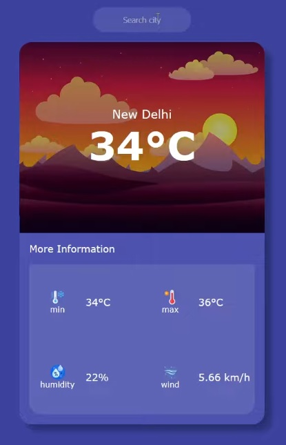

# WeatherApp

Weather applicatiion which use RapidWeather API.

This project was generated with [Angular CLI](https://github.com/angular/angular-cli) version 15.2.4.

### Development server

Run `ng serve` for a dev server. Navigate to `http://localhost:4200/`. The application will automatically reload if you change any of the source files.

## Screenshot

